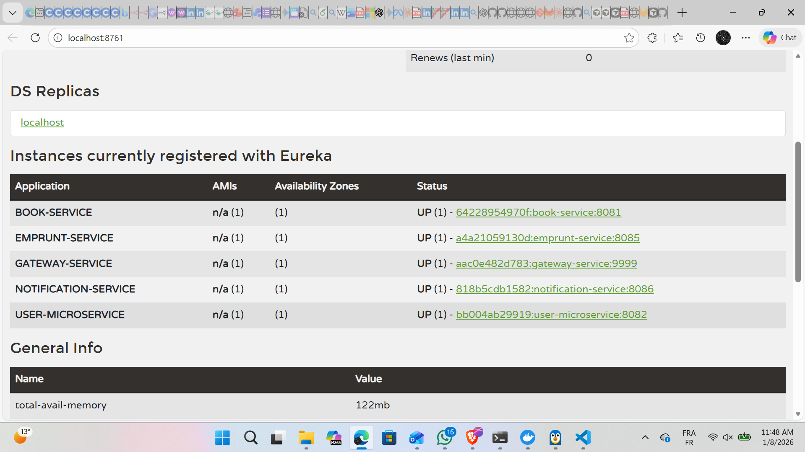
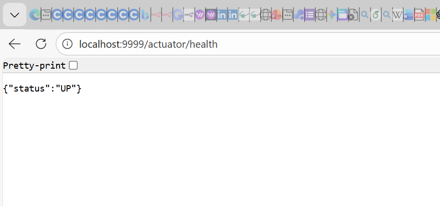
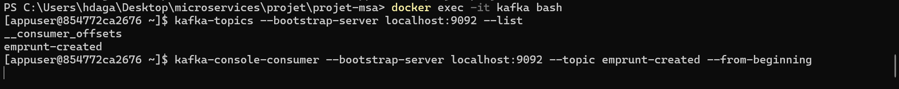
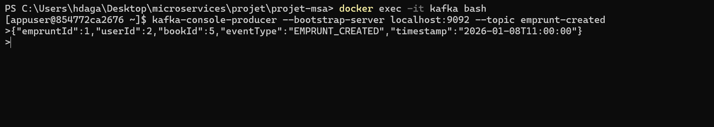
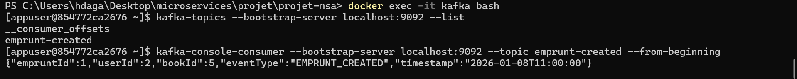

# 📚 Système de Gestion des Emprunts

> Architecture Microservices avec Spring Boot, Kafka et Docker

**Auteur:** DAGUAGUI Elhassan | Master M2SI

---

## 🎯 Vue d'Ensemble

Application moderne de gestion d'emprunts basée sur une **architecture microservices**, intégrant les dernières technologies du cloud computing et de la communication asynchrone.

### 🏗️ Stack Technique

- **6 Microservices** orchestrés via Eureka et API Gateway
- **3 Instances MySQL** (Database per Service pattern)
- **Apache Kafka** pour la communication événementielle
- **Docker Compose** pour le déploiement containerisé
- **Spring Cloud** pour la gestion distribuée

---

## 📋 Table des Matières

- [Architecture](#-architecture)
- [Services Déployés](#-services-déployés)
- [Bases de Données](#-bases-de-données)
- [Communication Kafka](#-kafka--communication-asynchrone)
- [Installation](#-installation-et-démarrage)
- [Tests et Validation](#-tests-et-validation)
- [Troubleshooting](#-troubleshooting)

---

## 🏛️ Architecture

### Topologie des Services

```
                        ┌───────────────┐
                        │  Client HTTP  │
                        └───────┬───────┘
                                │
                                ▼
                        ┌───────────────┐
                        │  API Gateway  │
                        │   Port 9999   │
                        └───────┬───────┘
                                │
                ┌───────────────┼───────────────┐
                │               │               │
                ▼               ▼               ▼
        ┌──────────────┐ ┌──────────────┐ ┌──────────────┐
        │ User Service │ │ Book Service │ │   Emprunter  │
        │  Port 8082   │ │  Port 8081   │ │  Port 8085   │
        └──────┬───────┘ └──────┬───────┘ └──────┬───────┘
               │                │                │
               └────────────────┴────────────────┘
                                │
                                ▼
                        ┌───────────────┐
                        │  Kafka Broker │
                        │   Port 9092   │
                        └───────┬───────┘
                                │
                                ▼
                        ┌───────────────┐
                        │ Notification  │
                        │   Port 8086   │
                        └───────────────┘
                                │
                ┌───────────────┼───────────────┐
                ▼               ▼               ▼
         ┌──────────┐    ┌──────────┐   ┌──────────┐
         │  MySQL   │    │  MySQL   │   │  MySQL   │
         │ db_user  │    │ db_book  │   │db_emprunt│
         └──────────┘    └──────────┘   └──────────┘
```

---

## 🔧 Services Déployés

| Service | Port | Rôle | Technologies |
|---------|------|------|--------------|
| **🔍 Eureka Server** | 8761 | Service Discovery & Registry | Netflix Eureka |
| **🚪 API Gateway** | 9999 | Point d'entrée unique, routage | Spring Cloud Gateway |
| **👤 User Service** | 8082 | Gestion des utilisateurs | Spring Boot, JPA, MySQL |
| **📖 Book Service** | 8081 | Gestion des livres | Spring Boot, JPA, MySQL |
| **📝 Emprunter Service** | 8085 | Gestion des emprunts | Spring Boot, Kafka Producer |
| **📬 Notification Service** | 8086 | Traitement événements | Spring Kafka Consumer |
| **📨 Kafka Broker** | 9092 | Message Streaming | Apache Kafka 3.8.1 |
| **🐘 Zookeeper** | 2181 | Coordination Kafka | Apache Zookeeper |

---

## 💾 Bases de Données

### Configuration MySQL (Database per Service)

| Port | Base de données | Service | Credentials |
|------|----------------|---------|-------------|
| **3306** | `db_user` | User Service | root / root |
| **3307** | `db_book` | Book Service | root / root |
| **3308** | `db_emprunter` | Emprunter Service | root / root |

### Accès aux Bases

```bash
# Base Users
docker exec -it mysql-user mysql -u root -p db_user

# Base Books
docker exec -it mysql-book mysql -u root -p db_book

# Base Emprunts
docker exec -it mysql-emprunt mysql -u root -p db_emprunter
```

---

## 📡 Kafka - Communication Asynchrone

### Configuration du Topic

```yaml
Topic: emprunt-created
Producteur: Emprunter Service (8085)
Consommateur: Notification Service (8086)
Partitions: 1
Replication Factor: 1
Format: JSON
```

### Structure du Message

```json
{
  "empruntId": 1,
  "userId": 3,
  "bookId": 5,
  "eventType": "EMPRUNT_CREATED",
  "timestamp": "2025-01-01T14:00:00"
}
```

### Flux de Traitement

1. **Création Emprunt** → Emprunter Service valide User + Book
2. **Persistance** → Enregistrement dans MySQL
3. **Publication** → Message envoyé sur Kafka (`emprunt-created`)
4. **Consommation** → Notification Service traite l'événement
5. **Notification** → Log et simulation d'envoi

---

## 🚀 Installation et Démarrage

### Prérequis

```bash
# Vérifier Docker
docker --version
# Docker version 20.10.0+

# Vérifier Docker Compose
docker-compose --version
# Docker Compose version 1.29.0+
```

### Démarrage du Système

```bash
# Cloner le projet
cd microservicesapp

# Démarrer tous les services
docker-compose up -d

# Vérifier le statut
docker-compose ps

# Consulter les logs
docker-compose logs -f
```

### Vérifications Post-Démarrage

**Eureka Dashboard**
```
http://localhost:8761
```

**Gateway Health Check**
```bash
curl http://localhost:9999/actuator/health
```

**Services Enregistrés**
```bash
curl http://localhost:8761/eureka/apps
```

---

## 🧪 Tests et Validation

### Endpoints Principaux

```bash
# Lister tous les utilisateurs
curl http://localhost:9999/api/users

# Lister tous les livres
curl http://localhost:9999/api/books

# Lister tous les emprunts
curl http://localhost:9999/api/emprunts
```

### Scénario Complet de Test

#### 1️⃣ Créer un Utilisateur

```bash
curl -X POST http://localhost:9999/api/users \
  -H "Content-Type: application/json" \
  -d '{
    "name": "John Doe",
    "email": "john@example.com"
  }'
```

#### 2️⃣ Créer un Livre

```bash
curl -X POST http://localhost:9999/api/books \
  -H "Content-Type: application/json" \
  -d '{
    "title": "1984",
    "author": "George Orwell"
  }'
```

#### 3️⃣ Créer un Emprunt

```bash
curl -X POST http://localhost:9999/api/emprunts/1/1
```

#### 4️⃣ Vérifier la Notification

```bash
docker logs -f notification-service | grep NOTIFICATION
```

### 📸 Captures d'Écran

#### Eureka Server - Services Enregistrés



*Tous les microservices correctement enregistrés dans Eureka Registry*

---

#### API Gateway - Health Check



*Gateway opérationnel et accessible sur le port 9999*

---

#### Kafka Topic - Messages Publiés



*Visualisation du topic `emprunt-created`*

---



*Messages d'emprunts publiés avec succès*

---



*Notification Service consomme les événements*

---

## 🔄 Flux Principal - Création d'Emprunt

```
┌────────┐     POST /api/emprunts/{userId}/{bookId}     ┌──────────┐
│ Client │ ──────────────────────────────────────────> │ Gateway  │
└────────┘                                               └────┬─────┘
                                                              │
                                                              ▼
                                                      ┌───────────────┐
                                                      │   Emprunter   │
                                                      │    Service    │
                                                      └───────┬───────┘
                                                              │
                                    ┌─────────────────────────┼─────────────┐
                                    │                         │             │
                                    ▼                         ▼             ▼
                            ┌──────────────┐        ┌──────────────┐  ┌─────────┐
                            │ Validate User│        │Validate Book │  │  MySQL  │
                            └──────────────┘        └──────────────┘  └─────────┘
                                                              │
                                                              ▼
                                                      ┌───────────────┐
                                                      │  Kafka Topic  │
                                                      │emprunt-created│
                                                      └───────┬───────┘
                                                              │
                                                              ▼
                                                      ┌───────────────┐
                                                      │ Notification  │
                                                      │    Service    │
                                                      └───────┬───────┘
                                                              │
                                                              ▼
                                                        [LOG SUCCESS]
```

---

## 🛠️ Détails Techniques

### Backend

- **Java:** 11+
- **Framework:** Spring Boot 3.x
- **Spring Cloud:** Gateway, Eureka, OpenFeign
- **Messaging:** Spring Kafka
- **ORM:** JPA / Hibernate
- **Build Tool:** Maven 3.6+

### Infrastructure

- **Database:** MySQL 8.0
- **Message Broker:** Apache Kafka 3.8.1
- **Coordination:** Apache Zookeeper
- **Containerization:** Docker & Docker Compose

### Networking

- Ports exposés pour accès externe
- Communication intra-conteneurs via réseau Docker
- Service Discovery dynamique via Eureka
- Load Balancing via Spring Cloud LoadBalancer

---

## 🔧 Commandes Utiles

### Gestion des Conteneurs

```bash
# Voir l'état des services
docker-compose ps

# Voir les logs en temps réel
docker-compose logs -f

# Logs d'un service spécifique
docker logs -f [service-name]

# Redémarrer un service
docker-compose restart [service]

# Arrêter tous les services
docker-compose down

# Arrêter et supprimer les volumes
docker-compose down -v

# Accéder à un conteneur
docker exec -it [container-name] bash
```

### Monitoring Kafka

```bash
# Lister les topics
docker exec -it kafka kafka-topics --list --bootstrap-server localhost:9092

# Détails d'un topic
docker exec -it kafka kafka-topics --describe --topic emprunt-created --bootstrap-server localhost:9092

# Consommer des messages
docker exec -it kafka kafka-console-consumer --topic emprunt-created --from-beginning --bootstrap-server localhost:9092
```

---

## ⚠️ Troubleshooting

| Problème | Cause Possible | Solution |
|----------|---------------|----------|
| **Service ne démarre pas** | Dépendances manquantes | `docker-compose logs [service]` |
| **BD non accessible** | Port déjà utilisé | Vérifier `netstat -an \| grep 3306` |
| **Service non dans Eureka** | Mauvaise config `spring.application.name` | Vérifier `application.yml` |
| **Kafka ne publie pas** | Bootstrap-servers incorrect | Vérifier `kafka:9092` |
| **Notification inactive** | Consumer Group non créé | Vérifier logs Kafka Consumer |
| **Gateway 503** | Services non enregistrés | Attendre 30s après démarrage |
| **Port déjà utilisé** | Autre service actif | `docker-compose down` puis retry |

### Logs de Débogage

```bash
# Niveau de log détaillé
export SPRING_PROFILES_ACTIVE=debug
docker-compose up -d

# Vérifier la connectivité réseau
docker network inspect microservicesapp_default
```

---

## 📚 Ressources Supplémentaires

- [Spring Cloud Documentation](https://spring.io/projects/spring-cloud)
- [Apache Kafka Documentation](https://kafka.apache.org/documentation/)
- [Netflix Eureka Wiki](https://github.com/Netflix/eureka/wiki)
- [Docker Compose Reference](https://docs.docker.com/compose/)

---

## 👨‍💻 Auteur

**DAGUAGUI Elhassan**  
Étudiant Master M2SI  


---

## 📝 Licence

Ce projet a été réalisé dans un cadre académique.

---

<div align="center">

**⭐ N'oubliez pas de donner une étoile si ce projet vous a été utile ! ⭐**

</div>